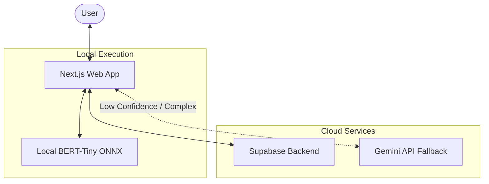

[← Back to Overview](../README.md)

# System Architecture

Sage is built with a distributed architecture that balances local performance with cloud-based intelligence.

## High-Level Diagram

## Component Overview

### 1. Web Application (`web/`)
The frontend is built with **Next.js** and **Tailwind CSS**. It serves as the primary interface for users to interact with the AI assistant. It handles:
- **Chat Interface**: A conversation-centric UI for adding and viewing expenses.
- **Local AI Integration**: Runs the ONNX model for real-time intent and entity extraction.
- **State Management**: Manages application state and synchronization with Supabase.

### 2. AI Engine (Hybrid `ai/` & Gemini)
This component is responsible for the performance-critical path of natural language processing.
- **Local Model**: A fine-tuned **BERT-Tiny** model running in-browser via ONNX for zero-latency processing.
- **Functionality**: Identifies if a user's message is an expense entry and extracts the `amount`, `category`, and `date`.
- **Gemini Fallback**: For complex, multi-intent queries or low-confidence local extractions, the system dynamically routes the context to Google's Gemini API (prioritizing `gemini-3.1-flash-lite`) to guarantee accurate JSON-structured extraction.

### 3. Shared Logic (`shared/`)
A collection of TypeScript models and utility functions shared between frontend and (future) backend or mobile environments.
- **Data Models**: Common definitions for `Expense`, `User`, and `Category`.

### 4. Backend (Supabase)
Cloud-based infrastructure for data storage and security.
- **Database**: PostgreSQL with Row-Level Security (RLS) policies.
- **Authentication**: User management and secure access.
- **Storage**: (Future) Storage for receipts and user-uploaded media.

## Data Flow

1.  **Input**: User types a message (e.g., "Paid 2000 for dinner").
2.  **Processing (Hybrid)**: The Web App runs the message through the local BERT model. If confidence is high, it extracts features locally. If confidence is low or the query is complex, it queries the Gemini API.
3.  **Persistence**: The resulting expense data is saved to **Supabase** (or locally via Dexie.js for offline support).
4.  **Feedback**: The user gets an immediate confirmation in the chat interface.
